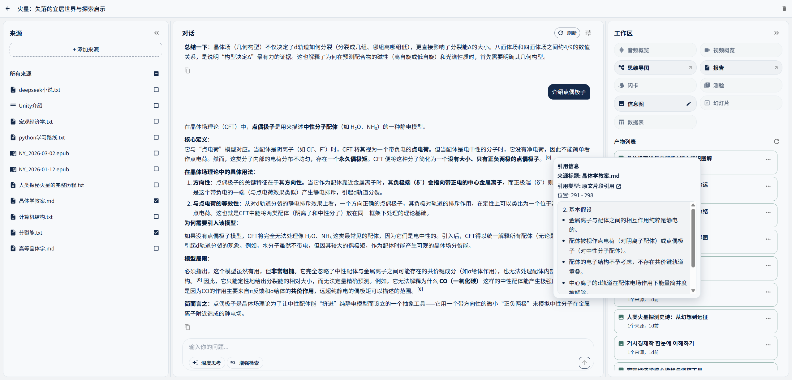
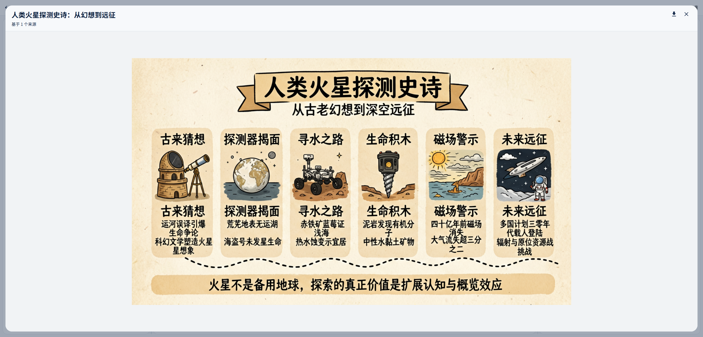
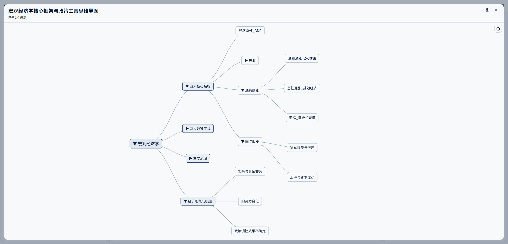
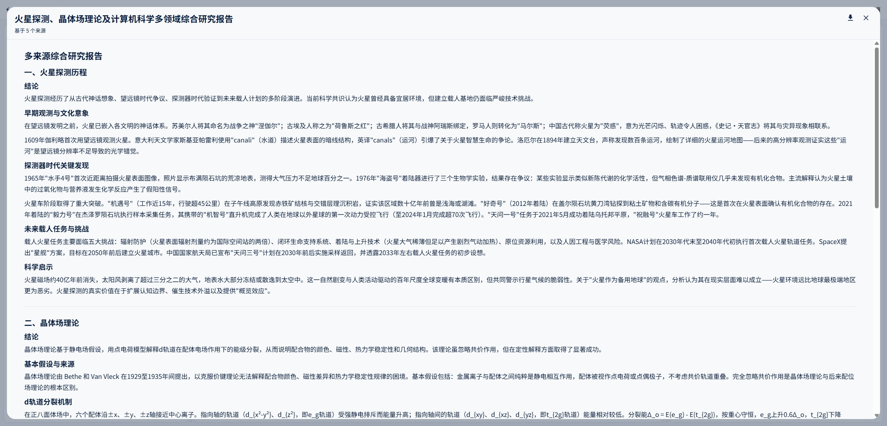

 

  

 
 

## GoNoteLM 

## Studio Showcase

<table border="1" cellspacing="0" cellpadding="8">
  <tbody>
    <tr>
      <td align="center" valign="top">
         
        Infographic
      </td>
      <td align="center" valign="top">
         
        Mindmap
      </td>
      <td align="center" valign="top">
         
        Report
      </td>
    </tr>
  </tbody>
</table>

