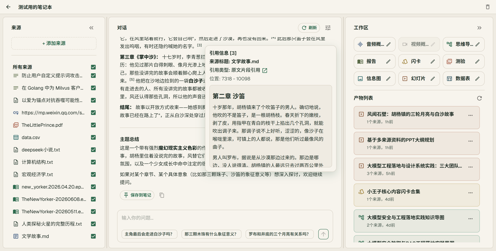
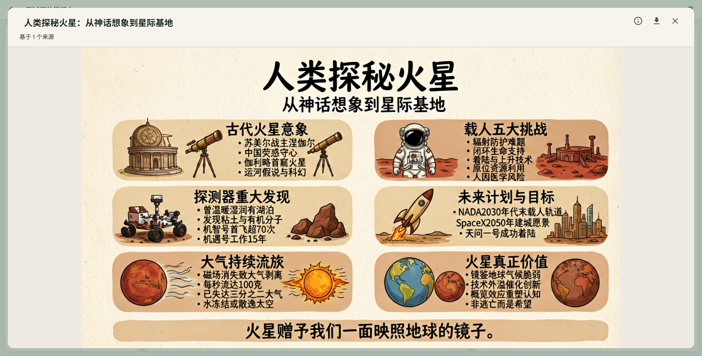
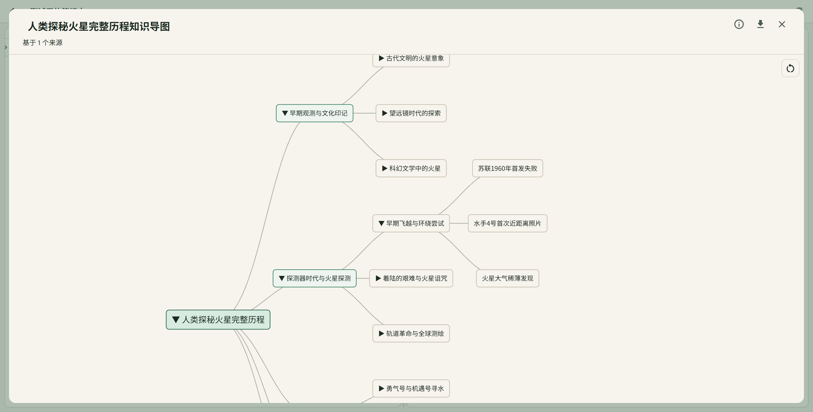
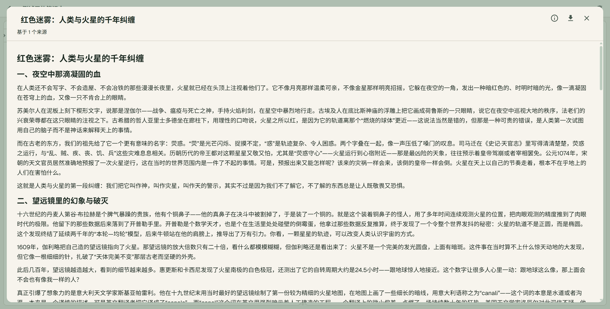
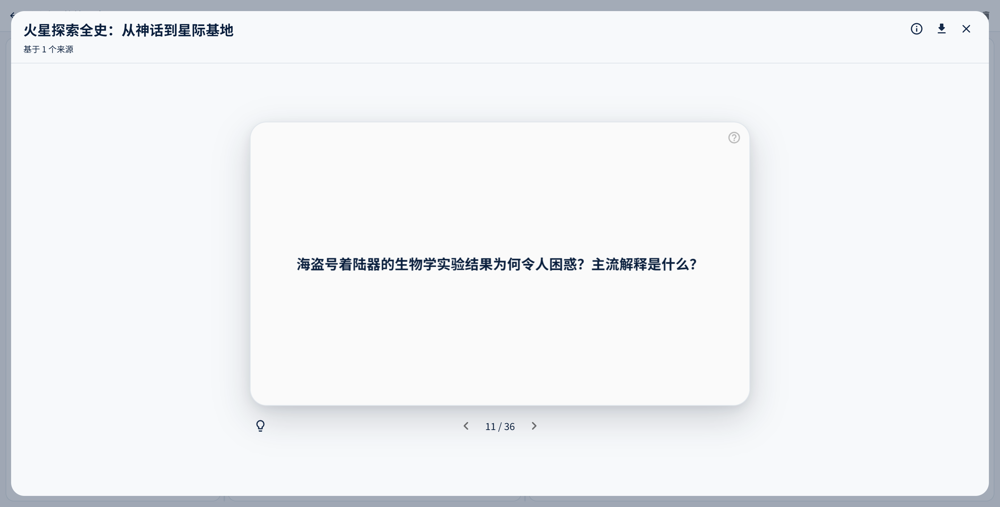
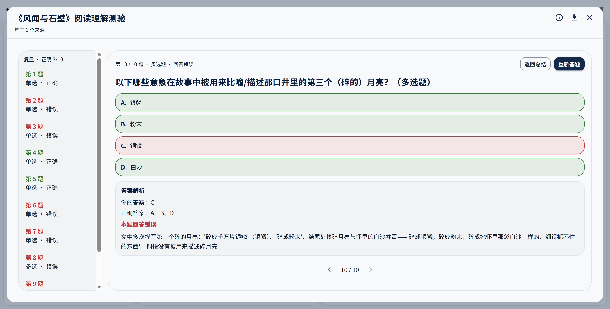
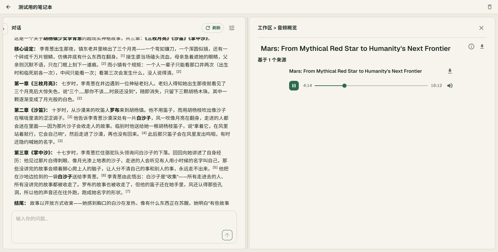
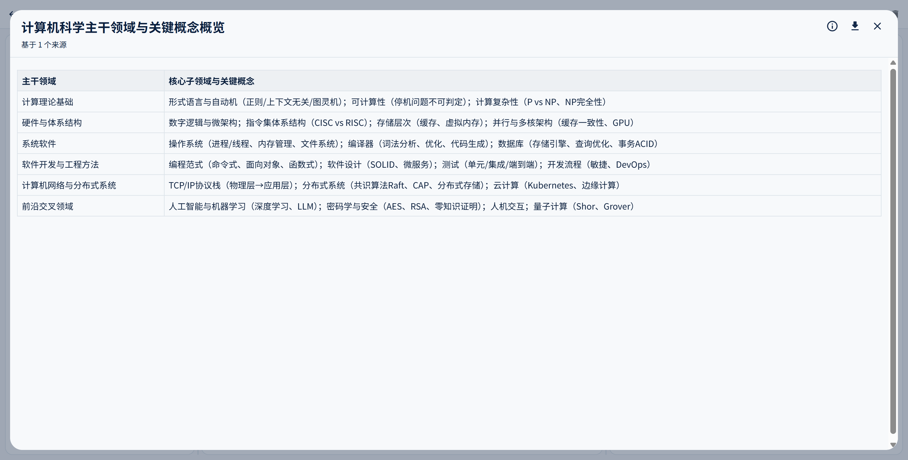
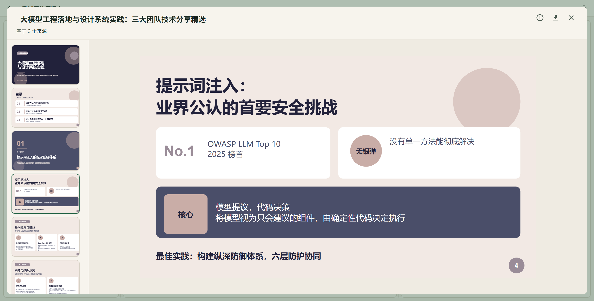

 

  

 
 

## GoNoteLM

GoNoteLM is an AI-powered learning and knowledge-management platform. Create notebooks, upload sources, chat with an agentic RAG system, and generate rich learning artifacts — all in one place.

### Core Capabilities

- **Notebooks** — Organize study materials into notebooks.
- **Source Ingestion** — Add text, URLs, or upload files (PDF, Markdown, EPUB, Word, CSV, XLSX) for AI processing.
- **Agentic RAG Chat** — Multi-turn conversations with AI that can search, read, cite, and analyze your sources in real-time. Supports streaming responses, thinking mode, and multiple chat styles.
- **AI Studio** — Generate learning artifacts from your sources: Mindmap, Report, Infographic, Audio Overview, Flashcard, Quiz, DataTable, and Slides. You can also save an assistant chat reply as a Note artifact.

## Studio Showcase

<table width="100%" border="1" cellspacing="0" cellpadding="8">
  <tbody>
    <tr>
      <td align="center" valign="top">
         
        Infographic
      </td>
      <td align="center" valign="top">
         
        Mindmap
      </td>
      <td align="center" valign="top">
         
        Report
      </td>
    </tr>
    <tr>
      <td align="center" valign="top">
         
        Flashcard
      </td>
      <td align="center" valign="top">
         
        Quiz
      </td>
      <td align="center" valign="top">
         
        Audio Overview
      </td>
    </tr>
    <tr>
      <td align="center" valign="top">
         
        Data Table
      </td>
      <td align="center" valign="top">
         
        Slides
      </td>
      <td></td>
    </tr>
  </tbody>
</table>

