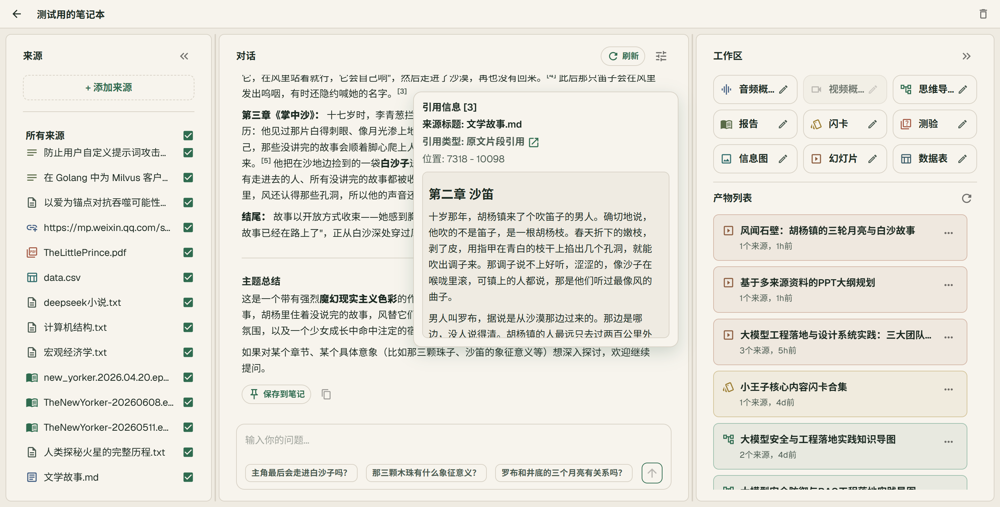
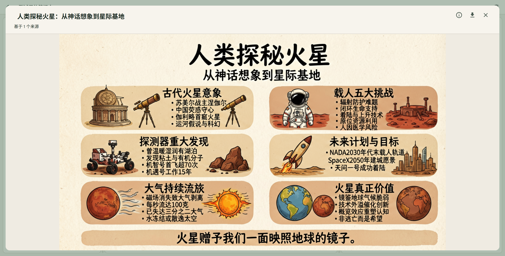
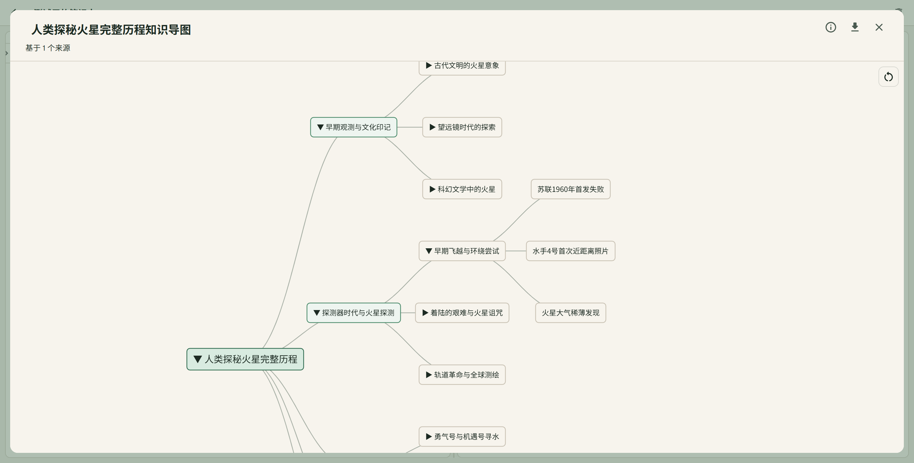
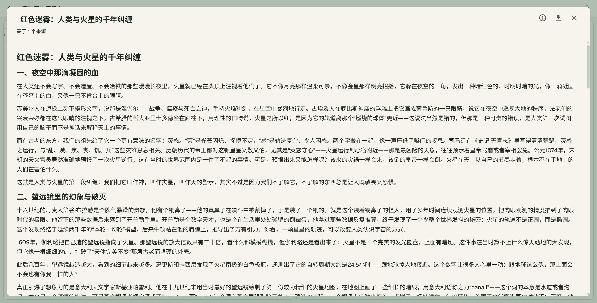
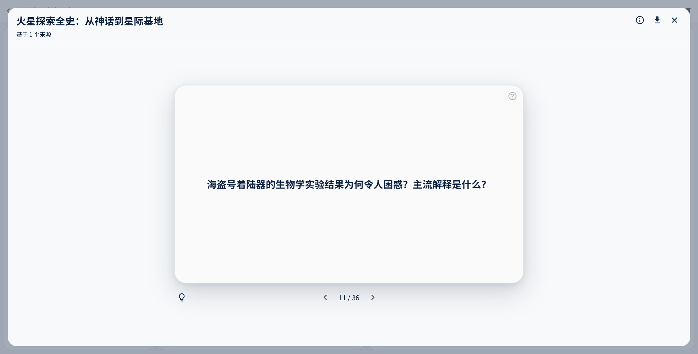
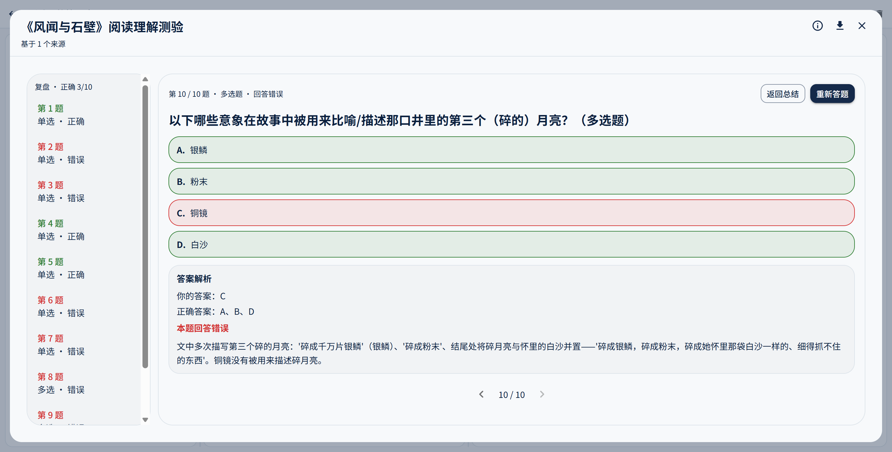
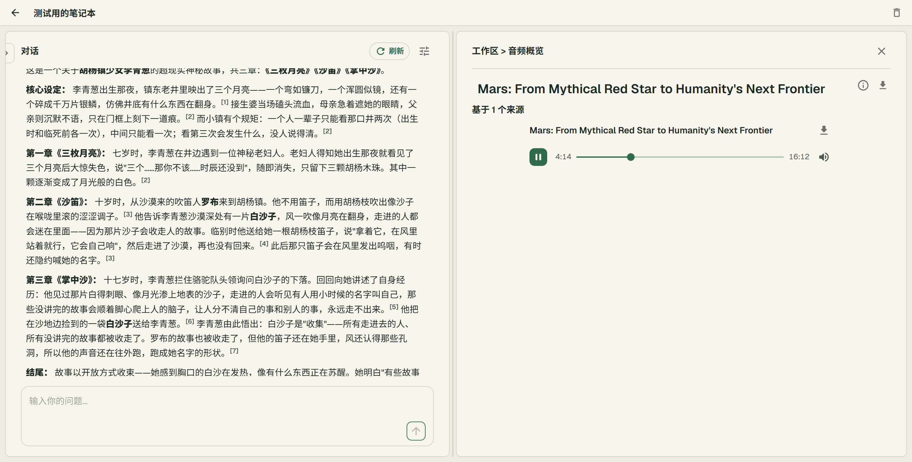
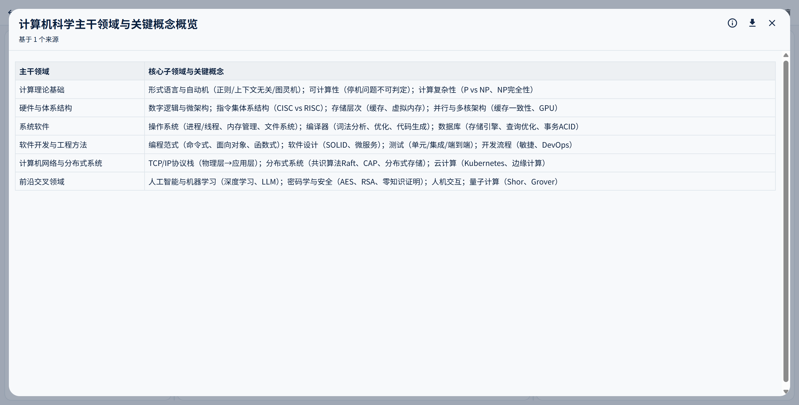
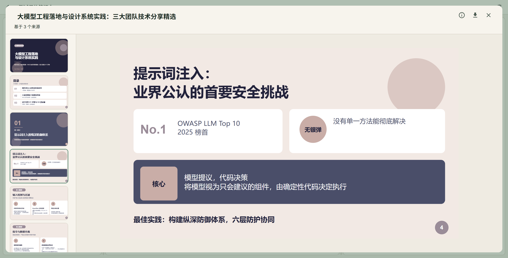
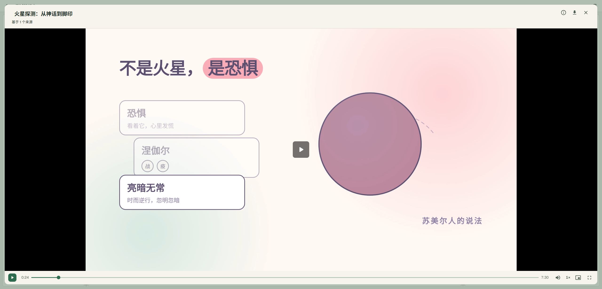

 

  

 
 

## GoNoteLM

GoNoteLM turns a pile of PDFs, links, and notes into real understanding. Upload your sources, ask anything, and watch an AI assistant search, cite, and explain — then generate mind maps, reports, quizzes, podcasts, and videos in seconds. Learn faster. Remember more. All in one place.

### Core Capabilities

- **Notebooks** — One home for every subject, project, or paper. Your sources, your answers, your history — neatly organized and always in context.
- **Source Ingestion** — Drop in anything — text, URLs, PDF, Markdown, EPUB, Word, CSV, XLSX. GoNoteLM reads it all so you don't have to.
- **Agentic RAG Chat** — Stop scrolling. Just ask. Get answers pulled straight from your own sources, with citations you can trust — streamed live, with a thinking mode that shows the work and chat styles that fit your flow.
- **AI Studio** — From source to study-ready in one click. Mindmap. Report. Infographic. Audio Overview. Video Overview. Flashcard. Quiz. DataTable. Slides. Even save any AI reply as a Note. Your knowledge, finally put to work.

## Studio Showcase

<table width="100%" border="1" cellspacing="0" cellpadding="8">
  <tbody>
    <tr>
      <td align="center" valign="top">
         
        Infographic
      </td>
      <td align="center" valign="top">
         
        Mindmap
      </td>
      <td align="center" valign="top">
         
        Report
      </td>
    </tr>
    <tr>
      <td align="center" valign="top">
         
        Flashcard
      </td>
      <td align="center" valign="top">
         
        Quiz
      </td>
      <td align="center" valign="top">
         
        Audio Overview
      </td>
    </tr>
    <tr>
      <td align="center" valign="top">
         
        Data Table
      </td>
      <td align="center" valign="top">
         
        Slides
      </td>
      <td align="center" valign="top">
         
        Video Overview
      </td>
    </tr>
  </tbody>
</table>

