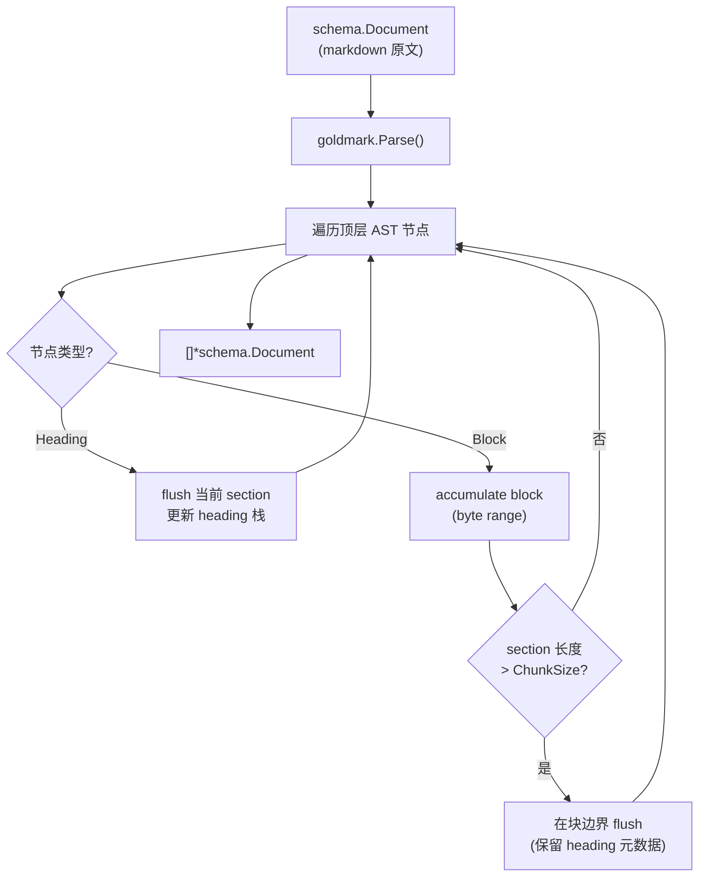

# Markdown AST Chunker 设计

## Summary

在 `pkg/eino-ext/chunker/markdown` 中实现 `document.Transformer` 接口，使用 goldmark
解析 markdown 语法树，按 Heading Section 结构切分文档。形式参考 `recursive` 包，
切分思路参考 `parsebuild.go` 的 AST 遍历，但不构建 DocTree、不做 embedding/LLM 摘要。

本包为独立组件，暂不接入 `ChunkTransformer`。

## 背景与动机

| 现有方案 | 问题 |
|---|---|
| cloudwego `HeaderSplitter` | 行级 `#` 字符串匹配，非 AST，列表/代码块边界不可靠 |
| `parsebuild.go` | 完整的 DocTree 构建 + span 映射 + split + embedding，过重 |
| `recursive` chunker | 句子级切分，无 markdown 结构感知 |

目标：用 goldmark AST 做轻量结构切分，尽量保持 markdown 结构完整性。

## 需求决策（已确认）

| 决策项 | 选择 |
|---|---|
| 切分单元 | Heading Section：标题 + 其下块，直到同级/更高级标题 |
| 超限处理 | 仅 AST 块边界拆分，不拆开单个 Paragraph/CodeBlock/List |
| 单块超限 | 整块输出为一个 chunk |
| 元数据 | 注入 heading 层级 + 原文位置（均在 markdown 包内自定义 key） |
| Config | ChunkSize + LenFunc + IDGenerator，无 Overlap |
| 内容提取 | 原文 byte range 切片（`source[start:end]`） |
| 接入 | 独立 pkg，暂不改 ChunkTransformer |

## 架构



### 推荐方案：单次 AST 遍历 + 在线打包

一次遍历 goldmark 顶层节点，维护 heading 栈与当前 section 的 block 列表。
section 超过 ChunkSize 时在块边界 flush 多个 chunk。

**排除方案：**
- 两阶段建树再打包：中间结构多余
- 递归 ast.Walk：goldmark heading 默认在顶层，过度设计

## 包结构

```
pkg/eino-ext/chunker/markdown/
├── markdown.go      # Config, NewSplitter, markdownChunker, Transform
├── split.go         # AST 遍历 + section 打包逻辑
├── range.go         # byte range 提取与合并
├── metadata.go      # heading 栈、元数据注入、rune index
├── markdown_test.go
└── testdata/        # markdown fixture
```

## 核心类型

```go
type Config struct {
    ChunkSize   int
    LenFunc     func(string) int
    IDGenerator func(ctx context.Context, originalID string, splitIndex int) string
}

type byteRange struct {
    start, end int
}

type headingEntry struct {
    level int
    title string
    br    byteRange
}

type sectionState struct {
    heading      *headingEntry   // 当前 section 所属 heading；nil 表示文档前言
    blocks       []byteRange
    pendingLen   int             // 当前累积内容的 LenFunc 长度
}
```

## 切分规则

### 1. 顶层 AST 遍历

参考 `parsebuild.go` 的遍历模式：

```go
for n := doc.FirstChild(); n != nil; n = n.NextSibling() {
    switch node := n.(type) {
    case *ast.Heading:
        flushCurrentSection()
        updateHeadingStack(node)
    default:
        accumulateBlock(node)
    }
}
flushCurrentSection()
```

### 2. Heading 栈

- 遇到新 heading（level L）：pop 栈直到栈顶 level < L
- push 新 heading entry
- heading title：从 heading 节点 `Lines()` byte slice 提取，trim `#` 前缀和空白

### 3. Block 累积

对所有非 Heading 顶层块（Paragraph、List、FencedCodeBlock、CodeBlock、Blockquote、
HTMLBlock、ThematicBreak 等）：

1. 从 `node.Lines()` 提取 `byteRange`
2. 追加到当前 section 的 blocks 列表
3. 累加 `LenFunc(source[br.start:br.end])` 到 pendingLen
4. 若 pendingLen > ChunkSize：在块边界 flush（见下）

### 4. Section Flush（打包输出）

**未超限：** 合并 blocks 的 `[blocks[0].start, blocks[n].end]` 为 content，输出一个 chunk。

**超限（块边界拆分）：**
- 贪心累加 blocks，当加入下一个 block 会超过 ChunkSize 时 flush 当前组
- 首 chunk：range 从 heading.start 到当前 blocks 组 end（含 heading 原文）
- 后续 chunk：range 仅含 blocks 组，不含 heading 行
- 所有 chunk 共享同一 heading 元数据（祖先 h1~h6）
- 绝不拆开单个 block；单个 block 超限则整块输出

**文档前言（heading 前的块）：** heading 为 nil，直接按块打包。

### 5. byte range 合并

```go
func mergeRanges(source []byte, ranges []byteRange) string {
    if len(ranges) == 0 {
        return ""
    }
    return string(source[ranges[0].start : ranges[len(ranges)-1].end])
}
```

goldmark 顶层块在 source 中连续，`first.start ~ last.end` 包含块间原始空白/换行。

## Transformer 接口

```go
func NewSplitter(ctx context.Context, config *Config) (document.Transformer, error)

type markdownChunker struct { ... }

func (c *markdownChunker) Transform(
    ctx context.Context,
    docs []*schema.Document,
    opts ...document.TransformerOption,
) ([]*schema.Document, error)

func (c *markdownChunker) GetType() string // "MarkdownChunker"
```

### Config 校验

| 条件 | 行为 |
|---|---|
| `config == nil` | 返回 error |
| `ChunkSize <= 0` | 返回 error |
| `LenFunc == nil` | 默认 `func(s string) int { return len(s) }` |
| `IDGenerator == nil` | 保留 originalID |

### Transform 行为

- 跳过 nil doc
- 尊重 `ctx.Err()`
- 每个 chunk 深拷贝原 doc MetaData
- 注入 markdown 包自定义元数据（见下）
- 过滤空 content chunk

## 元数据（markdown 包内自定义）

所有 key 在 `pkg/eino-ext/chunker/markdown` 中定义，不依赖 `internal/domain/entity`。

### Heading 元数据

```go
const (
    MetaHeadingH1Key = "md_h1"
    MetaHeadingH2Key = "md_h2"
    MetaHeadingH3Key = "md_h3"
    MetaHeadingH4Key = "md_h4"
    MetaHeadingH5Key = "md_h5"
    MetaHeadingH6Key = "md_h6"
)
```

- 值为对应层级 heading 的 title 文本
- 由 heading 栈填充：栈中 level=1 的 entry → `md_h1`，以此类推
- 无 heading 的前言 chunk：对应 key 不注入

### 位置元数据

```go
const (
    MetaChunkByteStartKey = "md_chunk_byte_start"
    MetaChunkByteEndKey   = "md_chunk_byte_end"
    MetaChunkRuneStartKey = "md_chunk_rune_start"
    MetaChunkRuneEndKey   = "md_chunk_rune_end"
)
```

| Key | 类型 | 含义 |
|---|---|---|
| `md_chunk_byte_start` | int | chunk 在原文中的起始 byte offset |
| `md_chunk_byte_end` | int | chunk 在原文中的结束 byte offset（exclusive） |
| `md_chunk_rune_start` | int | 起始 rune offset |
| `md_chunk_rune_end` | int | 结束 rune offset（exclusive） |

**计算方式：**
- byte offset：合并 range 时直接赋值
- rune offset：Transform 每个 doc 时对 source 建一次稀疏 rune index，byte → rune 查表

**不变量：** `chunk.Content == source[byte_start:byte_end]`

## 错误处理

| 场景 | 处理 |
|---|---|
| AST 节点无 Lines | 跳过该节点 |
| byte range 非法（start >= end） | 跳过该 block |
| 整篇文档无有效块 | 返回空 slice |
| ctx 取消 | 返回 ctx.Err() |

不做 parsebuild 级别的 span 二次映射。

## 依赖

```
github.com/yuin/goldmark
github.com/yuin/goldmark/ast
github.com/yuin/goldmark/text
github.com/cloudwego/eino/components/document
github.com/cloudwego/eino/schema
```

项目已有 `goldmark v1.8.2`，无需新增依赖。

## 测试计划

| 测试 | 覆盖点 |
|---|---|
| `TestImplementsTransformer` | 接口实现 + 原 metadata 深拷贝 |
| `TestHeadingSectionSplit` | H1 + 段落 + H2 + 段落 → 正确 chunk 数与 heading 元数据 |
| `TestOversizedSectionBlockBoundary` | 一个 section 下多个大段落 → 按块拆，不拆段内 |
| `TestSingleOversizedBlock` | 单个超大 CodeBlock → 整块输出 |
| `TestNoHeadingPreamble` | heading 前段落独立 chunk |
| `TestPreservesRawMarkdown` | content == source 子串，保留 fence/list marker |
| `TestChunkPositionMetadata` | byte/rune offset 与 content 一致 |
| `TestMultiChunkSectionPositions` | 超限 section 多 chunk 位置不重叠、不遗漏 |
| `TestNestedListAndCodeBlock` | 列表/代码块作为完整 block 不被拆分 |

## 明确不做（YAGNI）

- 不接入 ChunkTransformer
- 不做 overlap
- 不做 recursive 兜底
- 不构建 DocTree / LLM 摘要 / embedding
- 不使用 `indices/util.go` 的 AST 文本重建（用 byte range 原切片）
- 不引用 `internal/domain/entity` 的 metadata key

## 后续扩展（不在本次范围）

- 接入 ChunkTransformer 替换 cloudwego HeaderSplitter
- metadata key 与 entity 包的映射适配层
- 嵌套 blockquote 内 heading 的特殊处理
