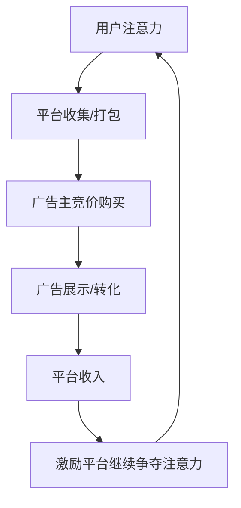
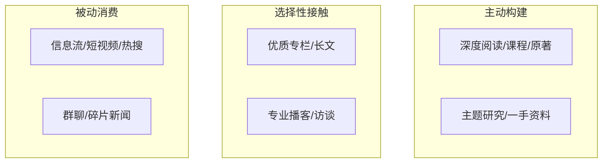

# 认知盈余时代：注意力、意义感与数字生活的重构

## 一、楔子：从“无聊”到“刷不完”

2026年的某个深夜，你躺在床上，拇指无意识地滑动屏幕。短视频一个接一个地闪过，图文帖子在眼前铺展又消失，你甚至不记得五分钟前看过什么。但手指停不下来——不是因为有趣，而是因为停下来之后，该做什么？

这不是你一个人的困境。这是数字时代最诡异的“富足悖论”：信息前所未有的充裕，注意力前所未有的稀缺；连接前所未有的便利，孤独感前所未有的深刻。我们把越来越多的时间投入数字世界，却越来越难从中打捞出让自己满意的意义。

这份文档试图梳理的，正是这个困境的来龙去脉。它不会给你“每天少看两小时手机”这种正确的废话，也不想贩卖“数字戒断”的焦虑生意。它想做的，是和你一起重新理解：当“注意力”成为这个时代最硬的通货，我们每个人的认知盈余，究竟该兑换成什么？

---

## 二、核心概念：注意力、认知盈余与意义感

### 2.1 注意力：唯一不可再生的资源

经济学家赫伯特·西蒙在半个世纪前就说过：**信息 consumes 注意力**。在信息爆炸的世界里，注意力的稀缺性超过了信息的稀缺性。

| 维度 | 传统经济资源 | 注意力资源 |
|------|-------------|-----------|
| 稀缺性 | 相对稀缺（可增产） | 绝对稀缺（每天固定24小时） |
| 分配方式 | 市场定价、所有权 | 争夺、捕获、收割 |
| 再生性 | 可再生或可替代 | 不可再生，用完即走 |
| 价值衡量 | 货币价格 | 单位时间内的认知投入深度 |

注意力不只是“时间”。它是**带着意图的清醒时刻**。看两小时烂片和读两小时好书，消耗的都是两小时，但前者消耗的是“时间”，后者消耗并滋养的是“注意力”。

### 2.2 认知盈余：被互联网释放的集体潜能

克莱·舍基在《认知盈余》里提出了一个经典公式：

> **认知盈余 = 自由时间 × 创造力 × 分享意愿**

互联网让数十亿人的碎片时间第一次有了被汇聚的可能。维基百科、开源软件、豆瓣影评、B站知识区——这些都是认知盈余的正面产物。但硬币的另一面是：同样的一小时，可以被用来编辑维基百科，也可以被用来刷100条15秒短视频。

关键区别在于：**前者生产公共物品，后者生产平台收益。**

### 2.3 意义感：数字消费的“汇率”

为什么同样花一小时，有人觉得充实，有人觉得空虚？

这里引入一个概念：**认知盈余的兑换汇率**。公式大致可以写成：

```
意义获得感 = 注意力投入深度 × (自主性 + 社会连接 + 可留存性) / 消费速度
```

- **自主性**：是我在主动选择，还是被算法推送？
- **社会连接**：我是在真实地与人交流，还是独自观看他人的表演？
- **可留存性**：这段经历是沉淀为我的记忆/能力/作品，还是滑过即忘？

当消费速度（刷屏速度）趋近无限大，分母爆炸，意义获得感趋近于零——这就是“刷了两个小时却像什么都没干”的数学解释。

---

## 三、现状诊断：我们正在经历什么？

### 3.1 平台经济的底层逻辑：注意力拍卖行

理解数字生活的第一步，是理解平台的商业模式。

绝大多数免费互联网平台的本质，是一个 **注意力拍卖行**：



这个循环没有内置的“善意刹车”。平台的优化目标不是“用户幸福”，而是“用户停留时长”和“广告转化率”。这不是阴谋论，是商业逻辑。就像你不会指望烟草公司劝你戒烟一样，你也不该指望注意力平台主动劝你放下手机。

### 3.2 注意力掠夺的三重机制

#### 第一重：无限滚动与间歇性奖励

心理学家斯金纳的鸽子实验早就揭示：**不确定的奖励比确定的奖励更容易让人上瘾**。下拉刷新，不知道下一条是什么，这种“也许有惊喜”的期待，是多巴胺最爱的配方。

#### 第二重：个性化茧房

算法不需要审查你的言论。它只需要不断给你看你已经同意的东西，你就会越来越觉得自己正确、别人荒谬，然后——你就不想离开了。愤怒和焦虑的留存率，天然高于平静和满足。算法的“中性”优化，事实上在批量生产极化情绪。

#### 第三重：社交货币通货膨胀

以前，分享一张旅行的照片，是为数不多的朋友真心点赞。现在，你的动态要和几百个“好友”、几十个群聊、以及无数专业内容创作者竞争注意力。为了获得同样多的关注，你需要越来越极致的表达、越来越夸张的标题、越来越快的反应速度。

**结果就是：我们都在被迫表演，而渐渐忘记了自己原本想说什么。**

### 3.3 一个典型的“注意力赤字周”

为了把问题具象化，我们模拟一个普通职场人的一周注意力账本：

| 时段 | 活动 | 注意力类型 | 意义获得感(1-10) |
|------|------|-----------|----------------|
| 周一早8:00 | 通勤刷短视频30min | 被动、碎片 | 2 |
| 周一午12:30 | 边吃饭边回微信15min | 反应性、多任务 | 3 |
| 周一晚9:00 | 看剧同时刷微博2h | 分裂、低投入 | 3 |
| 周二晨6:30 | 冥想/阅读20min | 主动、深度 | 9 |
| ……（中间省略） | …… | …… | …… |
| 周日深夜 | 焦虑地刷朋友圈1h | 被动+比较性焦虑 | 1 |

一周168小时，真正让这个人感到“充实”的，可能不到10个小时。这不是意志力问题——这是在和全球最聪明的几千名工程师设计的注意力收割系统对抗。

---

## 四、解构与重建：不同场景下的注意力策略

### 4.1 信息消费：从“吃”到“消化”

#### 金字塔模型

不是所有信息都值得同样对待。我们可以把信息消费分为三层：



策略不是“消灭底层”。那既不现实，也不必要（有些碎片信息确实能带来灵感和放松）。关键是 **调结构**：

- **底层**控制在总信息时间的30%以内；
- **中层**保持40%，用订阅、RSS、精选邮件等方式建立稳定输入；
- **顶层**保证30%，每周至少留出3段不受打扰的深度阅读/学习时间。

#### 一个可操作的“信息饮食”清单

| 类型 | 摄入频率建议 | 具体动作 |
|------|------------|---------|
| 新闻资讯 | 每天1次，固定时段 | 早/晚各15分钟浏览标题+深度读1篇 |
| 社交媒体 | 每天2-3次，每次≤15分钟 | 设定闹钟，响即停 |
| 长文/深度内容 | 每天至少30分钟 | 用阅读器离线保存，专注阅读 |
| 书籍 | 每周至少3小时 | 睡前阅读代替睡前刷屏 |
| 娱乐视频 | 每天≤45分钟 | 主动选择而非被动滑动 |

### 4.2 社交连接：从“广播”到“对话”

社交媒体的设计天然偏向“广播”——因为一对多的内容生产效率最高，也最容易产生数据。但人类对连接的需求，本质上是 **对话**——一来一回、彼此看见、共同建构意义。

#### 社交圈的“同心圆”模型

```
第一圈（核心层）：3-5人
    └── 可以深夜打电话的人
    └── 交流频率：每周至少深度交流1次
第二圈（重要层）：10-15人
    └── 重要的朋友、家人、导师
    └── 交流频率：每月至少1次有质量的互动
第三圈（活跃层）：50-100人
    └── 同事、同学、共同兴趣社群
    └── 交流频率：视具体项目/活动而定
第四圈（外围）：所有人
    └── 弱连接、点赞之交
    └── 随缘互动，不刻意维护
```

**策略**：把80%的社交精力投入前两圈。不要在第四圈消耗太多情绪能量——那个给你朋友圈点赞的陌生人，不值得你花10分钟编辑一条动态。

### 4.3 内容创作：从消费者到生产者的跃迁

认知盈余最有价值的出口，是 **从消费转向生产**。哪怕只是微小的生产。

#### 生产性活动的三个门槛

| 级别 | 示例 | 所需能力 | 意义感回报 |
|------|------|---------|-----------|
| 初级（记录） | 写日记、拍日常vlog、整理笔记 | 几乎没有 | ★★☆ |
| 中级（加工） | 写读书笔记、做知识卡片、剪旅行短片 | 整理+基础表达 | ★★★★ |
| 高级（创造） | 写文章、做播客、开发小工具、组织社群 | 系统思考+持续输出 | ★★★★★ |

大多数人停在“只看不写、只刷不发”。但哪怕是每周写一篇300字的“本周小结”，都能显著改变你和数字内容的关系——因为你开始 **主动组织**信息，而不再是被动接收。

#### 一个建议的启动方案：“5-3-1”创作法

- **每天5分钟**：记录今天最有感触的一件事（用便签/语音/随手拍）
- **每周30分钟**：把7天的碎片整理成一段连贯的文字/一条3分钟视频
- **每月1小时**：把4周的整理串联成一篇完整文章/一个主题分享

这个方案的巧妙之处在于：它不需要大块时间，但能把你从“纯消费者”慢慢推向下一个台阶。

### 4.4 数字极简主义：不是苦行，是筛选

很多人误解数字极简主义是“不用智能手机”“不上网”——这是对极简最大的误会。真正的数字极简，是 **主动选择那些对你有意义的技术使用方式**，而不是被动接受默认设置。

#### 四项可操作的“数字断舍离”

**第一项：清理信息源**
- 取关过去30天没有让你“眼前一亮或心头一动”的账号
- 退出那些沉默的、没有营养的、让你焦虑的群聊
- 把订阅源从200个砍到20个以内

**第二项：重置通知权限**
- 关掉所有非必要App的通知（保留：电话、短信、日历、即时通讯工具中的关键联系人）
- 把手机设为“灰度模式”，降低色彩对注意力的诱惑

**第三项：建立“数字安息日”**
- 每周选一天（比如周日），从日落到次日日出，不主动使用任何娱乐性数字服务
- 可以接电话、回必要邮件，但不刷信息流、不看短视频、不打游戏
- 目的不是惩罚，而是重新体验“没有屏幕的时间”是什么质感

**第四项：给每个工具一个“使用宪章”**
问自己三个问题：
> 1. 这个工具解决了我什么真实问题？
> 2. 有没有更低成本的离线替代方案？
> 3. 我每天/每周打算花多少时间在它上面？

写下来，贴在显眼处。比任何“防沉迷软件”都管用。

---

## 五、深层结构：注意力经济背后的社会与文化

### 5.1 从“生产型社会”到“注意力型社会”

丹尼尔·贝尔在《后工业社会的来临》中预言了信息成为核心资源。但他可能没预料到，信息的“价值”不是被用来生产，而是被用来捕获注意力。

我们用一张表来看这个变迁：

| 维度 | 工业时代 | 信息时代早期 | 注意力时代（现在） |
|------|---------|-------------|------------------|
| 核心资源 | 资本、劳动力 | 信息、知识 | 注意力、信任 |
| 主要矛盾 | 生产不足 | 信息不对称 | 注意力过载 |
| 成功指标 | GDP、生产率 | 信息化程度 | 用户时长、日活 |
| 人的角色 | 生产者/消费者 | 信息处理者 | 注意力供应者 |
| 主要风险 | 失业、贫困 | 数字鸿沟 | 意义感丧失、精神耗竭 |

**注意力时代最残酷的隐喻是：你不是平台的用户，你是平台的产品——你的注意力被打包出售给广告主。**

### 5.2 数字公共空间的“公地悲剧”

哈丁的“公地悲剧”在数字世界重演：每个平台都在最大化攫取用户的注意力，没有人真正维护“公共注意力资源”的健康。其结果是：

- **公共对话的质量下降**：极端声音覆盖温和声音，情绪宣泄覆盖理性讨论
- **信任的持续衰减**：深度伪造、AI生成内容、身份模糊让“眼见为实”成为历史
- **集体注意力的碎片化**：整个社会越来越难同时关注同一个重要议题

这不是某一家公司的错，而是激励结构的问题。就像在没有交通规则的路口，每个司机都选择最快通过，结果所有人都堵死。

### 5.3 代际差异：数字原住民的独特困境

“数字原住民”一代（在互联网环境中成长起来的人）面临着一个前人从未面对过的挑战：**他们在学会管理注意力之前，就已经被注意力经济深度塑造了**。

| 维度 | 数字移民（前互联网世代） | 数字原住民（互联网世代） |
|------|------------------------|------------------------|
| 与数字设备的关系 | 工具，需要学习使用 | 环境，天然在其中 |
| 对注意力的认知 | 知道“专心”是什么状态 | 可能从未体验过长时间深度专注 |
| 社交参照系 | 线下社区、邻里、同事 | 全球同龄人、网红、KOL |
| 意义来源 | 相对稳定（家庭、信仰、职业） | 流动、多元、需要自行建构 |
| 最大挑战 | 适应新技术 | **在过度连接中保持自我** |

数字原住民需要的不是“放下手机”的道德训诫，而是 **在数字环境中生存并繁荣的具体技能**——这正是本文试图提供的。

---

## 六、前景与可能：重建数字生活的四种路径

### 6.1 个人层面：主动设计“注意力预算”

就像财务预算一样，我们需要为自己的注意力做预算。

一个简单的模板：

```
我的每周注意力预算（168小时）

必要支出（睡眠、工作、通勤、家务）：~110小时
可支配注意力：~58小时

理想分配：
├── 深度工作/学习：15小时（每天约2小时）
├── 重要关系维护：10小时（每天约1.5小时）
├── 身体/健康（运动、做饭）：8小时
├── 休闲娱乐（主动选择）：15小时
│   ├── 阅读/观影 6h
│   ├── 爱好/创作 5h
│   └── 社交娱乐 4h
└── 弹性/缓冲：10小时
```

重点不是严格遵循——而是 **有意识地知道自己的时间去了哪里**。你不需要对每一分钟负责，但你值得对每天的大部分分钟有知情权。

### 6.2 技术层面：用工具对抗工具

讽刺的是，对抗注意力掠夺的最有效武器之一，恰恰是技术本身。这里推荐几类“反注意力经济”的工具：

| 类别 | 工具示例 | 作用机制 |
|------|---------|---------|
| 阅读器 | Instapaper / Pocket / Matter | 离线保存长文，隔离算法推荐 |
| 内容筛选 | RSS阅读器（Feedly/Inoreader） | 只显示你主动订阅的源 |
| 专注工具 | Forest / Freedom / Cold Turkey | 物理/软件层面屏蔽干扰网站 |
| 使用统计 | iOS屏幕时间 / RescueTime | 让注意力消耗可视化 |
| 慢社交 | Micro.blog / 邮件简报 | 降低更新频率，提高内容质量 |

核心原则是：**从“被推送”切换到“主动拉取”**。

### 6.3 社区层面：重建“附近的数字生活”

互联网杀死“附近”的说法已经老生常谈。但2020年代出现了一些反向趋势：

- **本地兴趣社群**的重新活跃（读书会、运动小组、共学社区）
- **基于地理位置的慢社交**（如“和邻居换书”“街区故事地图”）
- **去中心化平台**的尝试（Mastodon、Bluesky等联邦宇宙）

这些尝试的共同点是：它们不追求“最大范围的传播”，而是追求“最有质量的连接”。一个20人的本地读书会，带来的意义感可能超过2万个微博粉丝。

### 6.4 社会层面：政策与设计的转向

个人努力只能解决一部分问题。结构性问题需要结构性的回应：

- **注意力保护的立法**：类似欧盟GDPR，把“注意力数据”纳入保护范围，限制平台对用户注意力的过度攫取
- **算法透明义务**：要求平台公开推荐算法的核心目标和参数，接受第三方审计
- **数字素养教育**：从小学开始纳入“注意力管理”“信息甄别”“数字福祉”等课程
- **公共数字空间**：政府或非营利组织资助不依赖广告模式的公共内容平台

这些听起来遥远，但每一种都有先行者。韩国的“游戏宵禁”、加州的《消费者隐私法案》、欧盟的《数字服务法案》——**制度演进的脚步比我们想象的要快，但也比我们需要的要慢**。

---

## 七、结束语：在拥挤的房间里，为自己留一扇窗

回到开头那个深夜刷手机的场景。

如果我们把注意力比作一束光：在工业时代，光是稀缺的，人们小心翼翼地把它聚集在手电筒里，照亮需要看的地方；在注意力时代，光是泛滥的，四面八方都有探照灯对着你照，你反而什么都看不清了。

重建数字生活的本质，不是关掉所有灯躲进黑暗里，而是 **重新做那个拿着手电筒的人**——决定照向哪里、照多久、照亮什么。

这需要练习。会有反复。你仍然会被算法勾住、会被社交焦虑裹挟、会在深夜无意识地多刷了半小时。这都没关系。真正重要的是：

> **你开始意识到自己是注意力的大陆——不是被开采的矿场。**

当你下一次解锁手机时，也许可以多停留两秒钟，问自己：

*“我现在要打开的，是我想去的地方，还是它想让我去的地方？”*

那个停顿，就是自由的开始。

---

### 参考文献与延伸阅读

1. 克莱·舍基，《认知盈余：自由时间的力量》
2. 赫伯特·西蒙，《人工科学》（中关于注意力的论述）
3. 卡尔·纽波特，《深度工作》
4. 杰伦·拉尼尔，《互联网死了吗？——数字生活的十种主张》
5. 肖莎娜·祖博夫，《监控资本主义时代》
6. 尼古拉斯·卡尔，《浅薄：互联网如何改变我们的大脑》
7. Tristan Harris, “How Technology is Hijacking Your Mind” (TED Talk)
8. 欧文·戈夫曼，《日常生活中的自我呈现》（关于“表演性自我”的经典论述）

---

*本文约5800字。最初写于2026年6月，在一个没有推送通知的周日下午。希望你读到这里时，没有感到匆忙。*